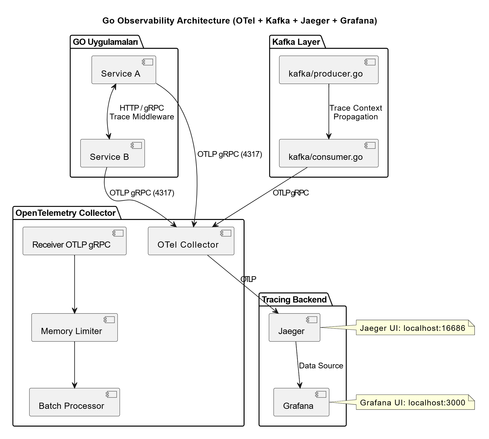

# go-otel-kit — Sistem Mimarisi

## Genel Bakış

Bu proje, Go uygulamalarına OpenTelemetry tabanlı distributed tracing entegrasyonu sağlar.
Trace verileri OTel Collector üzerinden Jaeger'a iletilir ve Grafana ile görselleştirilir.
HTTP, gRPC, Kafka, Redis ve PostgreSQL üzerindeki tüm servis çağrıları tek bir trace zinciri altında izlenebilir.

---

## Mimari Diyagram




---

## Bileşenler

| Bileşen            | Teknoloji                              | Port        | Açıklama                                    |
|--------------------|----------------------------------------|-------------|---------------------------------------------|
| HTTP Middleware     | `go-otel-kit/middleware`               | —           | HTTP isteklerini otomatik trace eder        |
| gRPC Interceptor   | `go-otel-kit/interceptor`              | —           | gRPC çağrılarını otomatik trace eder        |
| Kafka Wrapper      | `go-otel-kit/kafka`                    | —           | Kafka mesajlarında Trace Context taşır      |
| OTel Collector     | `otel/opentelemetry-collector-contrib` | 4317, 4318  | Trace toplama, işleme ve yönlendirme        |
| Jaeger             | `jaegertracing/all-in-one`             | 16686       | Trace depolama ve görselleştirme            |
| Grafana            | `grafana/grafana`                      | 3000        | Dashboard ve metrik görselleştirme          |
| Kafka              | `confluentinc/cp-kafka` (KRaft)        | 9092        | Asenkron mesajlaşma (Zookeeper'sız)         |
| PostgreSQL         | `postgres:16-alpine`                   | 5432        | İlişkisel veritabanı                        |
| Redis              | `redis:7-alpine`                       | 6379        | Cache katmanı                               |

---

## Trace Akışı

Bir HTTP isteğinin sistemden geçişi aşağıdaki sırayla gerçekleşir:

```
1. HTTP isteği gelir
   └─► TraceMiddleware yeni bir Span başlatır (SpanKind: SERVER)
       └─► Trace ID üretilir, Context'e eklenir

2. Servisler arası HTTP/gRPC çağrısı
   └─► Trace Context, HTTP header veya gRPC metadata'ya Inject edilir
       └─► Hedef servis, header'ı Extract eder ve aynı Trace'e bağlanır

3. Kafka mesajı üretilir (ProducerSend)
   └─► Trace Context, mesaj header'larına yazılır (SpanKind: PRODUCER)

4. Kafka mesajı tüketilir (ConsumerReceive)
   └─► Header'dan Trace Context okunur (SpanKind: CONSUMER)
       └─► Yeni Span, orijinal Trace'e bağlanır — zincir kopmaz

5. Veritabanı / Redis çağrısı
   └─► GORM plugin ve go-redis hook, Span'leri otomatik oluşturur

6. Span'ler OTel Collector'a gönderilir (OTLP gRPC)
   └─► memory_limiter → batch processor → Jaeger exporter

7. Jaeger'da trace görüntülenir
   └─► http://localhost:16686 → Service seç → Find Traces

8. Grafana'da görselleştirme
   └─► http://localhost:3000 → Service Map veya Trace Explorer dashboard'u
```

---

## Future Scope: V2 Metrics & Logs (ADR)

Mevcut OpenTelemetry (OTel) entegrasyonumuzun V1 sürümü, yalnızca Dağıtık İzleme (Distributed Tracing) altyapısına odaklanmıştır. V2 sürümünde, Gözlemlenebilirliğin (Observability) diğer iki temel sütunu olan Metrikler (Metrics) ve Loglar (Logs) sisteme dahil edilecektir.

Bu kapsamda yapılan teknoloji taraması sonucunda alınan mimari kararlar (Architecture Decision Record) aşağıdadır:

### 1. Veri Toplama ve İletim (Unified Pipeline)
* Uygulama seviyesinde (Go) metrik ve log toplamak için `go.opentelemetry.io/otel/metric` ve `go.opentelemetry.io/otel/log` paketleri kullanılacaktır.
* Go servisleri, topladıkları metrik ve logları doğrudan hedef veritabanlarına yazmak yerine, V1'de kurduğumuz **OTel Collector**'a (OTLP gRPC üzerinden `localhost:4317` portuna) gönderecektir.
* Sistemde OTel Collector, "Unified Ingestion Point" (Tekil Veri Giriş Noktası) olarak görev yapacak ve uygulama kodunu altyapı bağımlılıklarından izole edecektir.

### 2. Metrik Altyapısı: Prometheus
* **Seçim Nedeni:** OpenTelemetry ile tam uyumlu olması, yüksek eşzamanlılığa sahip sistemlerde saniyede binlerce isteği (RPS), aktif goroutine sayılarını ve bellek tüketimini izlemek için hafif ve performanslı (pull tabanlı) bir endüstri standardı olması.
* **Akış:** OTel Collector, pipeline üzerinden aldığı metrikleri `prometheus_exporter` arayüzü ile dışarı açacak; Prometheus arka planda bu verileri toplayıp (scrape) saklayacaktır.

### 3. Log Altyapısı: Grafana Loki
* **Seçim Nedeni:** Elasticsearch (ELK) gibi yüksek RAM ve CPU tüketen karmaşık arama motorları yerine; "Loglar için Prometheus" felsefesiyle çalışan, sadece etiketleri (label/metadata) indeksleyerek kaynak tüketimini minimumda tutan hafif mimarisi.
* **Akış:** OTel Collector, metin tabanlı uygulama loglarını işleyerek OTLP üzerinden doğrudan Loki'ye aktaracaktır. Bu sayede Trace ID'ler ile loglar otomatik olarak eşleşecektir.

### 4. Görselleştirme ve Korelasyon: Grafana
* V2 aşamasında Grafana; Jaeger (Tracing), Prometheus (Metrics) ve Loki (Logs) araçlarının tamamına veri kaynağı (Data Source) olarak bağlanacaktır.
* Bu PLG (Prometheus, Loki, Grafana) entegrasyonu sayesinde sistem sağlığı, "Single Pane of Glass" (Tek Ekran) prensibiyle, tek bir arayüzden korelasyonlu (birbirine bağlı) olarak izlenebilecektir.


---  
