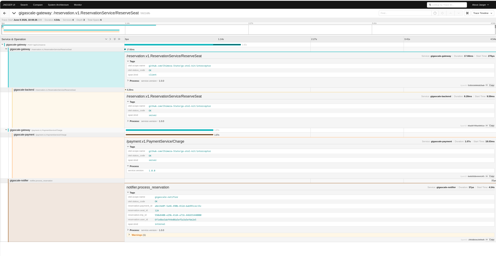
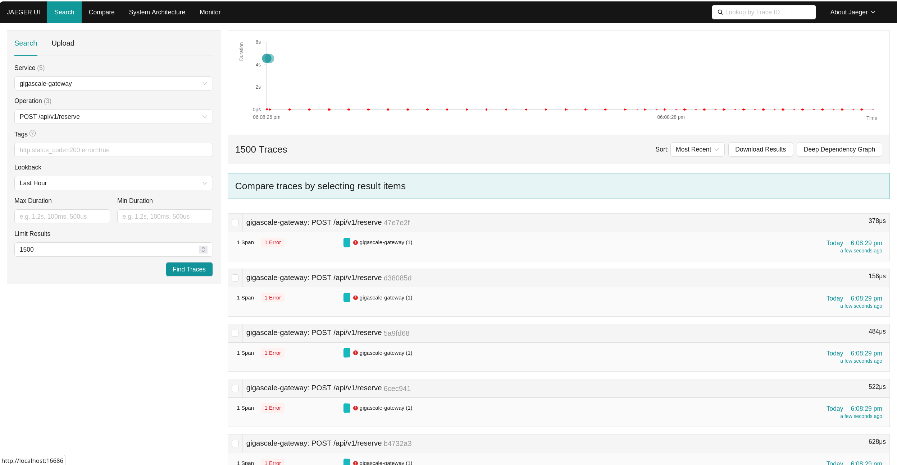
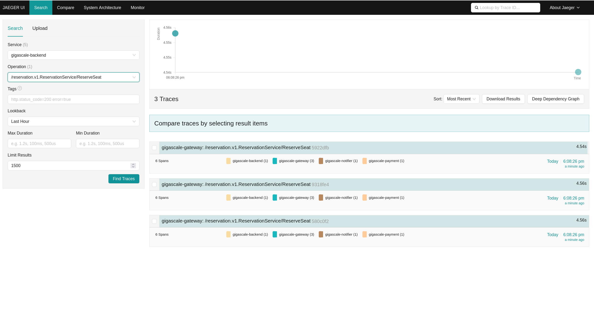

[English](README.md) | [Türkçe](README.tr.md)

# go-otel-kit

`go-otel-kit` is an OpenTelemetry-based tracing utility library for Go applications. It provides reusable instrumentation for HTTP, gRPC, Kafka, Redis, and PostgreSQL, and integrates with Jaeger and Grafana for trace visualization.

---

## Overview

This repository includes both the tracing library and example applications that demonstrate how to:

- initialize an OpenTelemetry provider
- instrument HTTP servers and clients
- add gRPC interceptors
- propagate trace context through Kafka
- instrument Redis and GORM-backed PostgreSQL operations

---

## Requirements

- Docker
- Go 1.21+
- Git

---

## Quick Start

Start the full observability stack:

```bash
docker compose -f docker-compose.full.yml up -d
```

Check stack status:

```bash
docker compose -f docker-compose.full.yml ps
```

Stop the stack:

```bash
docker compose -f docker-compose.full.yml down
```

---

## Ports

| Service         | Port  | Description                          |
|----------------|-------|--------------------------------------|
| Jaeger UI      | 16686 | Trace visualization UI               |
| OTel Collector | 4317  | OTLP gRPC endpoint                   |
| OTel Collector | 4318  | OTLP HTTP endpoint                   |
| OTel Collector | 8888  | Collector internal metrics           |
| Grafana        | 3000  | Dashboard UI                         |
| Kafka          | 9092  | Kafka broker                         |
| PostgreSQL     | 5432  | Database                             |
| Redis          | 6379  | Cache                                |

---

## User Interfaces

- Jaeger: http://localhost:16686
- Grafana: http://localhost:3000
  - Username: `admin`
  - Password: `admin`

---

## Example HTTP Trace

Run the example HTTP service:

```bash
cd examples/http
go run main.go
```

Send a request:

```bash
curl http://localhost:8080/hello
```

Open Jaeger and select the service `example-http-service` to inspect traces.

---

## Trace Visualizations

Here are some real-world traces collected by `go-otel-kit` in the Jaeger UI:





---

## Backend Integration Guide

### Installation

```bash
go get github.com/Chimera-State/go-otel-kit
```

### Initialize the Tracer Provider

```go
package main

import (
	"context"
	"log"

	"github.com/Chimera-State/go-otel-kit/setup"
)

func main() {
	ctx := context.Background()

	err := setup.Init(ctx,
		setup.WithServiceName("my-backend-service"),
		setup.WithServiceVersion("1.0.0"),
		setup.WithExporterEndpoint("localhost:4317"),
		setup.WithSamplingRate(1.0),
	)
	if err != nil {
		log.Fatalf("failed to initialize tracer: %v", err)
	}
	defer setup.Shutdown(ctx)

	// Application logic
}
```

### HTTP Middleware

```go
tracedHandler := middleware.TraceMiddleware(mux)
http.ListenAndServe(":8080", tracedHandler)
```

### gRPC Interceptor

```go
grpcServer := grpc.NewServer(
	grpc.UnaryInterceptor(interceptor.UnaryServerInterceptor()),
)
```

### Kafka Trace Propagation

```go
// PRODUCER
func PublishEvent(ctx context.Context, client *kgo.Client) {
	record := &kgo.Record{Topic: "orders-topic", Value: []byte("new-order")}
	kafka.InjectToRecord(ctx, record)
	client.Produce(ctx, record, nil)
}

// CONSUMER
func ConsumeEvent(client *kgo.Client) {
	ctx := context.Background()
	fetches := client.PollFetches(ctx)
	iter := fetches.RecordIter()
	for !iter.Done() {
		record := iter.Next()
		extractedCtx := kafka.ExtractFromRecord(ctx, record)
		tracer := otel.Tracer("kafka-consumer")
		_, span := tracer.Start(extractedCtx, "process-order-event")

		// business logic

		span.End()
	}
}
```

### Redis and PostgreSQL (GORM)

```go
// Redis
redisotel.InstrumentTracing(rdb)

// GORM
db.Use(tracing.NewPlugin())
```

---

## Benchmark: Tracing Overhead

The following values show example latency differences when tracing is enabled.

| Operation      | Tracing Off | Tracing On | Overhead    |
|----------------|-------------|------------|-------------|
| HTTP Request   | ~1.201 ms   | ~1.248 ms  | +0.047 ms   |
| gRPC Call      | ~0.842 ms   | ~0.875 ms  | +0.033 ms   |
| Kafka Publish  | ~2.110 ms   | ~2.132 ms  | +0.022 ms   |

---

## Project Structure

```
go-otel-kit/
├── docker-compose.yml          # Development environment
├── docker-compose.full.yml     # Full observability stack
├── otel-collector-config.yml   # OTel Collector pipeline configuration
├── setup/                      # TracerProvider initialization and shutdown
├── middleware/                 # HTTP tracing middleware
├── interceptor/                 # gRPC tracing interceptor
├── kafka/                      # Kafka trace propagation helpers
├── grafana/                    # Grafana dashboards and provisioning files
└── examples/                   # Example applications
	├── http/                   # HTTP example
	├── grpc/                   # gRPC example
	└── redis-pg/               # Redis + PostgreSQL example
```

